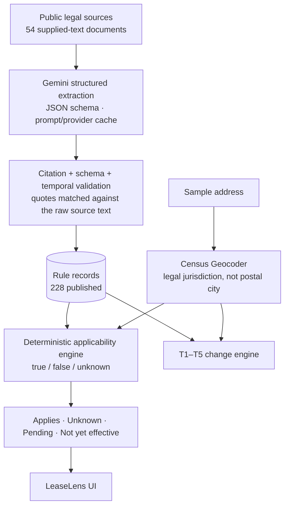

# LeaseLens

**Auditable rental-law guidance by property, jurisdiction and date: every answer cites the exact source text, and the system says "unknown" when the data can't settle a question.**

Hack-Nation 2026 · Rental Housing Law Navigator challenge · Team **Rule of One** (solo)

> Informational prototype for hackathon purposes. **Not legal advice.**

## Problem

Rental rules vary by state, city, property characteristics and date. A building's postal city is not necessarily its legal jurisdiction: "Dorchester" is in Boston, and "San Ysidro" is in San Diego. Property records are incomplete: owner occupancy, subsidies and certificate-of-occupancy dates are missing. A tool that guesses confidently in these cases is dangerous. LeaseLens answers only what the evidence supports, and shows its work.

## Demo

- **Live demo:** `<DEMO_URL>` (placeholder)
- **Run locally:** `uv sync` then `uv run streamlit run app.py`

How to use it:
1. Pick a demo address, or any of the 500 challenge addresses.
2. Choose an as-of date (default 2026-10-01).
3. See the property facts, the Census-resolved jurisdiction and every rule that applies, with a reason and a verbatim quote for each.
4. Open the **Change scenarios** tab to see the five official tests, T1–T5.

The app reads only the committed outputs, so it needs no API key, Census call or database.

## What it does

```
legal source → automated extraction → exact citation verification
            → jurisdiction resolution → deterministic applicability → temporal / change reasoning
```

## Architecture

**The LLM is used only to extract rules from unstructured legal text. Applicability is decided by deterministic Python.**



| Stage | What runs | Code |
|---|---|---|
| Extraction | Gemini (`gemini-3.8-flash`) structured output. A content-addressed cache of prompts and provider responses makes reruns reproducible and free. A bounded repair pass handles anything left uncovered. | `src/navigator/extraction/` |
| Verification | Each quoted span must match the raw source text exactly (or after whitespace and punctuation normalization). Records failing this are rejected, never published. Status, version and date evidence are verified the same way. | `extraction/citation.py`, `quotes.py` |
| Temporal | Explicit and relative effective dates are resolved from verified text ("first day of the twelfth month next following enactment"). Records with an unclear legislative status, or that are expired, held or pending, are kept separate from in-force law. | `extraction/temporal.py`, `validity.py`, `legislative.py` |
| Jurisdiction | Census batch and point lookups. Ties and boundary edge cases are inspected, reviewed overrides are recorded with their evidence, and unresolved addresses stay unresolved. | `src/navigator/jurisdiction/` |
| Applicability | Coverage conditions and exemptions are classified into property facts; three-valued AND/OR logic produces `applies` / `unknown` / omitted, with the missing facts named. | `src/navigator/applicability/` |
| Change tests | T1–T5 are run deterministically, with no LLM: as-of transitions, a city-boundary test, a pending-bill test and a failed-measure test. | `src/navigator/changes.py` |

## Results

| Stage | Result |
|---|---|
| **M3 Extraction** | 54 supplied-text documents handled; **228 publishable rules**. 0 schema failures, 0 duplicate IDs, 0 citation failures among published records (210 exact + 18 normalized quote matches). 183 records held and 15 rejected rather than published. |
| **M4 Jurisdiction** | 500 addresses: **473 resolved, 20 review, 7 unresolved**. 33 postal-city ≠ legal-city cases handled (Boston neighbourhoods, San Ysidro). 8 reviewed overrides, each with recorded evidence. |
| **M5 Applicability** | All 500 lookup rows. 14,508 applies · 16,131 unknown · 662 pending. 135 exempt results omitted. Deterministic and reproducible. Explicit unknowns, never guesses. |
| **M6 Change tests** | T1–T5 each generated exactly once; all five official scenarios unblocked. T1 248 CA · T2 90 (Hoboken 40, Jersey City 50, no Newark) · T3 139 NJ, 90 conflict-flagged · T4 105 MA pending · T5 0. |
| **Tests** | **380 passing**, with network access blocked for the whole suite. |

Estimated Gemini spend, from API-reported tokens: about $0.96 for the final full-corpus run (`outputs/m3/full_v2/spend_ledger.json`), plus about $0.11 for one targeted M6 re-extraction.

Submission files: [`outputs/submission/`](outputs/submission/) holds `rules.json`, `lookups.json`, `changes.json` and `submission_summary.md`.

## Reliability and responsible design

- **Exact source citations.** Every published rule carries a quote verified against the supplied text, and the app shows it verbatim.
- **No fabricated jurisdiction.** The postal city is never trusted. Unresolved addresses are never assigned a city, and every rule is reported `unknown` for them.
- **Missing facts lead to `unknown`.** The app names the fact it needs, such as owner occupancy or subsidy status.
- **Law status is kept distinct.** Pending bills show as `pending`, never `applies`. Failed measures are never surfaced. Enacted-but-future law shows as `not_yet_effective`.
- **Expired rules are excluded** from the current view (3 historical records are kept only in the audit).
- **Review queues are preserved** for extraction, jurisdiction and change mapping (`review/`, `outputs/m4/jurisdiction_review_queue.json`).
- **Not legal advice** appears in the app, the outputs and this README.

## Known limitations

1. **Some rules from explanatory pages are held rather than published,** because their current operative dates could not be established safely. Most notably, New Jersey just-cause and deposit guidance (D067) is held.
2. **The Hoboken and Jersey City ordinance texts (T2) are link-only in the supplied corpus.** The change scenario therefore uses organizer-supplied test facts and Census geography, without fabricating a legal quote.
3. **The NJ FAIR Act rule stays rejected from the base rule set,** because its model quote inserted bracket characters that are not in the source. T3 uses the effective date verified from the source text (2027-07-01) and the organizer-supplied scenario facts.
4. **Some applicability remains `unknown`,** because owner occupancy, subsidy status, owner type, certificate-of-occupancy dates and other facts are absent from the challenge dataset. `year_built` stands in for certificate-of-occupancy age only where the challenge README allows it, with the cutoff year treated as unknown.
5. **No local rules are published for Cambridge, Hoboken, Jersey City or Newark.** Only state rules are evaluated there.
6. **The app's date picker can move away from 2026-10-01,** but only recorded effective dates are re-checked. The submitted `lookups.json` is for 2026-10-01.

## Run locally

```bash
uv sync
uv run streamlit run app.py                      # demo (offline)
uv run pytest                                    # 380 tests, network blocked
uv run python scripts/check_submission.py        # validate outputs/submission/
```

The pipeline stages that need network access or an API key are already run, and their outputs are committed: `scripts/extract_rules.py` / `run_corpus.py` (Gemini; reads `GEMINI_API_KEY` from `.env`), `resolve_jurisdictions.py` (Census), `build_lookups.py` and `build_changes.py`. See [docs/SETUP.md](docs/SETUP.md).

## Repository structure

```
app.py                          LeaseLens Streamlit demo
src/navigator/extraction/       Gemini extraction, citation/temporal verification, repair, cache
src/navigator/jurisdiction/     Census geocoding and jurisdiction resolution
src/navigator/applicability/    property facts, condition classifier, three-valued engine
src/navigator/changes.py        T1–T5 change engine
src/navigator/demo.py           read-only data layer for the app
scripts/                        pipeline entry points and validators
outputs/m3/full_v2/  m4/  m5/  m6/   frozen stage outputs (with audits)
outputs/submission/             final rules.json, lookups.json, changes.json
review/                         human-review decisions (jurisdiction overrides, change-test map)
docs/                           design notes per stage; challenge_participant_guide.md (original brief)
corpus/ data/ dev/ schema/ submission_templates/   official starter pack (unmodified)
```

## Disclaimer

LeaseLens is an informational prototype built for a hackathon. It is **not legal advice**, and it may be incomplete or wrong. Consult the cited sources and a qualified professional before acting.
