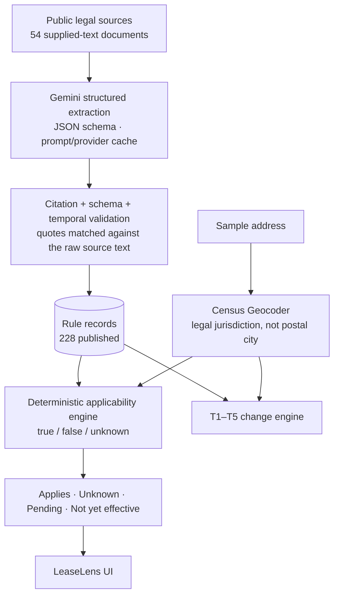

# LeaseLens

LeaseLens is a rental-housing law navigator built by team Maverick for the RealPage challenge at Hack-Nation 2026.

Give it one of the 500 supplied rental properties and an as-of date. It works out which city the property legally belongs to, finds the state and city rules that cover it, and explains what applies, what is still pending, and what can't be decided from the available property data.

The design rests on one split. Gemini turns messy legal text into structured rule records, and each record carries a quote that is checked against the source. Plain deterministic Python then decides whether each rule applies to a property. When the evidence isn't enough, LeaseLens answers `unknown` and names the missing fact instead of guessing.

It's a hackathon prototype that works on the supplied corpus. Not legal advice.

## Why this is hard

Rental rules depend on the state, the city, the building and the date. The postal city on an address isn't always the legal city: "Dorchester" is part of Boston, and "San Ysidro" is part of San Diego. The property records are also thin. They don't say whether the owner lives in the building, whether it's subsidized, or when its certificate of occupancy was issued, and a lot of rules turn on exactly those facts.

## Demo

- Live demo: https://leaselens-maverick.streamlit.app/
- Run locally: `uv sync`, then `uv run streamlit run app.py`

Pick one of the demo addresses (or any of the 500) and a date, 2026-10-01 by default. The app shows the property facts, the Census-resolved jurisdiction, and each matching rule with its status, the reason for it, and the quoted source text. The **Change scenarios** tab shows the five official change tests, T1–T5.

The app reads only the committed outputs, so it runs without an API key, Census access or a database.

## How it works

Extraction is the only step that uses an LLM. Everything after it is ordinary Python that you can rerun offline.



| Step | What happens | Code |
|---|---|---|
| Extraction | Gemini (`gemini-3.8-flash`) returns rule records against a JSON response schema. Prompts and responses are cached by content hash, so a rerun gives the same output without new API calls. A bounded repair pass revisits provisions the first pass missed. | `src/navigator/extraction/` |
| Citation checks | Each quote has to match the raw source text, either exactly or after whitespace and punctuation normalization. A record that fails is rejected. Status and date evidence get the same check. | `extraction/citation.py`, `quotes.py` |
| Dates and status | Effective dates come from verified text, including relative ones such as "the first day of the twelfth month next following the date of enactment". Pending, failed, expired and held records are kept apart from law in force. | `extraction/temporal.py`, `validity.py`, `legislative.py` |
| Jurisdiction | Census Geocoder batch and point lookups, also cached. Ties and near-boundary matches are flagged for review, manual overrides are recorded with their evidence, and addresses Census can't place stay unresolved. | `src/navigator/jurisdiction/` |
| Applicability | Each coverage condition and exemption is mapped to a property fact and evaluated as true, false or unknown. Rules that clearly don't apply are left out. Uncertain ones come back as `unknown` with the missing fact named. | `src/navigator/applicability/` |
| Change tests | T1–T5 run on the same records and jurisdictions, with no LLM involved: two date transitions, a city-boundary check, a pending-bill check and a failed-measure check. | `src/navigator/changes.py` |

## Results

These numbers come from the committed outputs and the current test run.

| | |
|---|---|
| Extraction | 54 supplied-text documents processed, 228 rules published. Every published quote matches its source (210 exactly, 18 after normalization), with no schema failures or duplicate IDs. Another 183 records were held and 15 rejected. |
| Jurisdiction | 500 addresses: 473 resolved, 20 flagged for review, 7 unresolved. 33 addresses have a postal city that differs from their legal city. 8 manual overrides, each with recorded evidence. |
| Applicability | A lookup row for every one of the 500 addresses at 2026-10-01: 14,508 `applies`, 16,131 `unknown`, 662 `pending`. Another 135 results were left out because a property exemption clearly applies. |
| Change tests | T1–T5 each produced once. T1 covers 248 California addresses. T2 covers 40 in Hoboken and 50 in Jersey City, none in Newark. T3 covers 139 New Jersey addresses, 90 of them flagged for a possible conflict with the local bans. T4 reports 105 Massachusetts addresses as pending. T5 affects none. |
| Tests | 388 passing. The suite blocks network access, so it runs offline. |

The `unknown` count is high on purpose. The most common missing facts are owner occupancy, subsidy status and whether a local ordinance covers the building, none of which are in the sample data.

Gemini spend, estimated from API-reported token counts, was about $0.96 for the final full-corpus run (`outputs/m3/full_v2/spend_ledger.json`), plus about $0.11 for one targeted re-extraction used in T3.

The submission files are in [`outputs/submission/`](outputs/submission/): `rules.json`, `lookups.json`, `changes.json` and `submission_summary.md`.

## How it avoids guessing

- Every published rule carries a quote checked against the supplied text, and the app shows that quote verbatim.
- The postal city is never treated as the legal city. If Census can't place an address, it gets no city, and every rule comes back `unknown` for it.
- When a rule depends on a fact the data doesn't have, the result is `unknown` and the app says which fact.
- Pending bills show as `pending`, never `applies`, and failed measures don't appear at all. A law that is enacted but not yet in force shows as `not_yet_effective`.
- Expired rules are left out. The 3 historical records stay in the audit files only.
- Review decisions live in the repo: the extraction review queue (`outputs/m3/full_v2/review_queue.json`), jurisdiction overrides and the change-test mapping (`review/`), and the jurisdiction review queue (`outputs/m4/jurisdiction_review_queue.json`).

## Known limitations

1. Some rules from explanatory pages, such as government guides rather than statutes, were held instead of published, because a current operative date couldn't be verified. The biggest gap is New Jersey's just-cause and security-deposit guidance (D067).
2. Many results are `unknown` because the dataset doesn't include owner occupancy, subsidy status, owner type or the exact certificate-of-occupancy date. Where the challenge brief allows it, `year_built` stands in for certificate-of-occupancy age, and a building built in the cutoff year stays unknown.
3. The Hoboken and Jersey City ordinances behind T2 were link-only in the corpus. T2 therefore uses the organizer-supplied scenario facts and Census geography, and no quote is shown for those ordinances.
4. The NJ FAIR Act candidate record was rejected because its quote contained bracket characters that aren't in the source. I kept the citation check strict rather than loosen it for one record. T3 uses the effective date verified from the bill text (2027-07-01) and the scenario facts.
5. Cambridge, Hoboken, Jersey City and Newark have no published local rules, so only state rules are evaluated there.
6. The app's date picker re-checks recorded effective dates only. The submitted `lookups.json` is for 2026-10-01.

## Run locally

```bash
uv sync
uv run streamlit run app.py                      # demo (offline)
uv run pytest                                    # 388 tests, network blocked
uv run python scripts/check_submission.py        # validate outputs/submission/
```

The steps that need network access or an API key have already been run, and their outputs are committed. To rerun them:
- `scripts/extract_rules.py` and `scripts/run_corpus.py` call Gemini, reading `GEMINI_API_KEY` from `.env`.
- `scripts/resolve_jurisdictions.py` calls the Census Geocoder.
- `scripts/build_lookups.py` and `scripts/build_changes.py` run offline.

See [docs/SETUP.md](docs/SETUP.md) for details.

## Repository structure

```
app.py                          LeaseLens Streamlit demo
src/navigator/extraction/       Gemini extraction, citation/temporal verification, repair, cache
src/navigator/jurisdiction/     Census geocoding and jurisdiction resolution
src/navigator/applicability/    property facts, condition classifier, three-valued engine
src/navigator/changes.py        T1–T5 change engine
src/navigator/demo.py           read-only data layer for the app
scripts/                        pipeline entry points and validators
outputs/m3/full_v2/  m4/  m5/  m6/   frozen stage outputs (with audits)
outputs/submission/             final rules.json, lookups.json, changes.json
review/                         human-review decisions (jurisdiction overrides, change-test map)
docs/                           design notes per stage; challenge_participant_guide.md (original brief)
corpus/ data/ dev/ schema/ submission_templates/   official starter pack (unmodified)
```

## Disclaimer

LeaseLens is a hackathon prototype. It isn't legal advice and may be incomplete or wrong. Check the cited sources, and talk to a qualified professional before acting on anything here.
